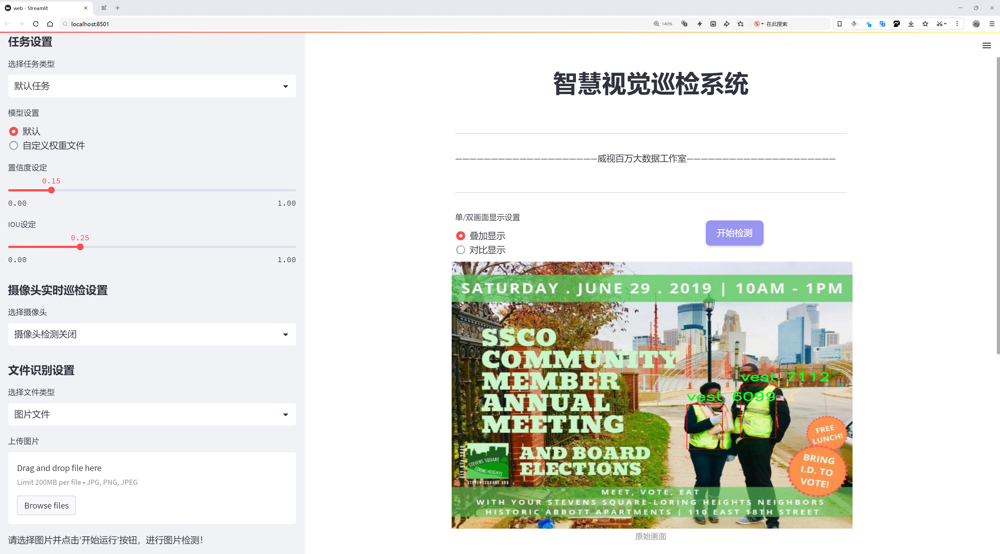

# 个人安全防护装备检测检测系统源码分享
 # [一条龙教学YOLOV8标注好的数据集一键训练_70+全套改进创新点发刊_Web前端展示]

### 1.研究背景与意义

项目参考[AAAI Association for the Advancement of Artificial Intelligence](https://gitee.com/qunmasj/projects)

项目来源[AACV Association for the Advancement of Computer Vision](https://github.com/qunshansj/good)

研究背景与意义

随着社会经济的快速发展和工业化进程的加快，个人安全防护装备（PPE）的使用变得愈发重要。尤其是在建筑、制造、化工等高风险行业，PPE的佩戴不仅关乎工人的个人安全，也直接影响到企业的生产效率和安全管理水平。根据相关统计数据，因未佩戴或不当佩戴防护装备而导致的事故频发，给社会和家庭带来了巨大的经济损失和心理创伤。因此，开发高效的个人安全防护装备检测系统，能够及时识别和提醒工人佩戴必要的防护装备，对于提升安全管理水平、降低事故发生率具有重要的现实意义。

在此背景下，计算机视觉技术的迅猛发展为PPE的检测提供了新的解决方案。YOLO（You Only Look Once）系列模型因其高效的实时目标检测能力，逐渐成为各类视觉识别任务中的主流选择。特别是YOLOv8作为该系列的最新版本，凭借其更为优化的网络结构和算法，能够在保证检测精度的同时，大幅提升检测速度，适用于实时监控和智能安全管理场景。然而，现有的YOLOv8模型在特定领域的应用上仍存在一定的局限性，尤其是在针对特定类别的PPE检测任务时，如何提高模型的准确性和鲁棒性，仍然是一个亟待解决的问题。

本研究旨在基于改进的YOLOv8模型，构建一个高效的个人安全防护装备检测系统。我们将利用包含4611张图像的多类别数据集，该数据集涵盖了手套、护目镜、安全帽、口罩、人员、鞋子和背心等七个类别。这些类别的选择不仅反映了当前工业安全防护的主要需求，也为模型的训练和测试提供了丰富的样本。通过对数据集的深入分析和处理，我们将对YOLOv8模型进行针对性的改进，以提升其在复杂环境下的检测能力和适应性。

此外，本研究的意义还在于推动智能安全管理技术的发展。通过实现对PPE的自动检测和识别，可以为企业提供实时的安全监控解决方案，帮助管理者及时发现和纠正员工的安全隐患，从而有效降低事故发生的风险。同时，该系统的应用也将促进安全文化的建设，提高员工的安全意识和自我保护能力，形成良好的安全生产氛围。

综上所述，基于改进YOLOv8的个人安全防护装备检测系统的研究，不仅具有重要的理论价值，也具有广泛的应用前景。通过这一研究，我们希望能够为安全生产领域提供一种高效、智能的解决方案，推动行业的安全管理水平提升，最终实现保护工人生命安全和健康的目标。

### 2.图片演示





##### 注意：由于此博客编辑较早，上面“2.图片演示”和“3.视频演示”展示的系统图片或者视频可能为老版本，新版本在老版本的基础上升级如下：（实际效果以升级的新版本为准）

  （1）适配了YOLOV8的“目标检测”模型和“实例分割”模型，通过加载相应的权重（.pt）文件即可自适应加载模型。

  （2）支持“图片识别”、“视频识别”、“摄像头实时识别”三种识别模式。

  （3）支持“图片识别”、“视频识别”、“摄像头实时识别”三种识别结果保存导出，解决手动导出（容易卡顿出现爆内存）存在的问题，识别完自动保存结果并导出到tempDir中。

  （4）支持Web前端系统中的标题、背景图等自定义修改，后面提供修改教程。

  另外本项目提供训练的数据集和训练教程,暂不提供权重文件（best.pt）,需要您按照教程进行训练后实现图片演示和Web前端界面演示的效果。

### 3.视频演示

[3.1 视频演示](https://www.bilibili.com/video/BV1hYpieiEja/)

### 4.数据集信息展示

##### 4.1 本项目数据集详细数据（类别数＆类别名）

nc: 7
names: ['glove', 'goggle', 'helmet', 'mask', 'person', 'shoe', 'vest']


##### 4.2 本项目数据集信息介绍

数据集信息展示

在构建一个高效的个人安全防护装备检测系统时，数据集的选择与构建至关重要。本项目所使用的数据集名为“ta-deteksi-ppe-fhrz”，其设计旨在支持改进YOLOv8模型，以实现对个人安全防护装备的精准检测与识别。该数据集包含七个类别，具体为：手套（glove）、护目镜（goggle）、安全帽（helmet）、口罩（mask）、人（person）、鞋子（shoe）和背心（vest）。这些类别的选择反映了在各种工作环境中，尤其是在建筑、制造和医疗等行业中，个人防护装备的重要性。

数据集“ta-deteksi-ppe-fhrz”不仅涵盖了多种常见的个人防护装备，还考虑到了不同工作场景下的实际应用。手套和护目镜是许多行业中不可或缺的装备，能够有效保护工人免受化学品、细小颗粒和其他潜在危害的侵害。安全帽则是建筑工地和其他高风险环境中必备的防护工具，能够有效降低头部受伤的风险。口罩在当前全球健康危机中显得尤为重要，能够有效防止有害颗粒和病原体的传播。鞋子和背心同样在特定环境中发挥着保护作用，确保工人在工作时的安全与舒适。

数据集的构建过程考虑到了多样性和代表性，确保每个类别都有足够的样本以支持模型的训练与验证。数据集中的图像涵盖了不同的拍摄角度、光照条件和背景环境，使得模型在实际应用中能够更好地适应各种复杂情况。这种多样性不仅提高了模型的鲁棒性，还增强了其在真实场景中的应用能力。

在数据标注方面，所有图像均经过精确标注，确保每个防护装备的边界框和类别信息的准确性。这种高质量的标注为模型的训练提供了坚实的基础，使得YOLOv8能够有效学习到各类防护装备的特征。通过使用“ta-deteksi-ppe-fhrz”数据集，研究人员能够对模型进行细致的调优，进而提升其在个人安全防护装备检测任务中的性能。

此外，数据集的使用还为后续的研究提供了丰富的基础。研究人员可以在此基础上进行更深入的分析，例如探讨不同防护装备在特定环境下的使用频率、识别精度等。这些分析不仅有助于优化个人防护装备的配置，还能为相关政策的制定提供数据支持。

总之，数据集“ta-deteksi-ppe-fhrz”在个人安全防护装备检测系统的构建中扮演了至关重要的角色。通过对七个类别的精心设计与构建，该数据集为YOLOv8模型的训练提供了丰富的素材，助力实现更高效、更精准的检测系统，进而提升工作场所的安全性。


### 5.全套项目环境部署视频教程（零基础手把手教学）

[5.1 环境部署教程链接（零基础手把手教学）](https://www.ixigua.com/7404473917358506534?logTag=c807d0cbc21c0ef59de5)


[5.2 安装Python虚拟环境创建和依赖库安装视频教程链接（零基础手把手教学）](https://www.ixigua.com/7404474678003106304?logTag=1f1041108cd1f708b01a)

### 6.手把手YOLOV8训练视频教程（零基础小白有手就能学会）

[6.1 环境部署教程链接（零基础手把手教学）](https://www.ixigua.com/7404477157818401292?logTag=d31a2dfd1983c9668658)

### 7.70+种全套YOLOV8创新点代码加载调参视频教程（一键加载写好的改进模型的配置文件）

[7.1 环境部署教程链接（零基础手把手教学）](https://www.ixigua.com/7404478314661806627?logTag=29066f8288e3f4eea3a4)

### 8.70+种全套YOLOV8创新点原理讲解（非科班也可以轻松写刊发刊，V10版本正在科研待更新）

由于篇幅限制，每个创新点的具体原理讲解就不一一展开，具体见下列网址中的创新点对应子项目的技术原理博客网址【Blog】：


[8.1 70+种全套YOLOV8创新点原理讲解链接](https://gitee.com/qunmasj/good)

### 9.系统功能展示（检测对象为举例，实际内容以本项目数据集为准）

图9.1.系统支持检测结果表格显示

  图9.2.系统支持置信度和IOU阈值手动调节

  图9.3.系统支持自定义加载权重文件best.pt(需要你通过步骤5中训练获得)

  图9.4.系统支持摄像头实时识别

  图9.5.系统支持图片识别

  图9.6.系统支持视频识别

  图9.7.系统支持识别结果文件自动保存

  图9.8.系统支持Excel导出检测结果数据


### 10.原始YOLOV8算法原理

原始YOLOv8算法原理

YOLOv8作为Ultralytics在2023年1月发布的最新目标检测模型，代表了YOLO系列算法的又一次重要进化。该算法在前期版本的基础上，综合了YOLOX、YOLOv6、YOLOv7和PPYOLOE等多个先进算法的设计理念，尤其在头部标签分配和损失函数的处理上，借鉴了PP-YOLOE的成功经验。这种集成的设计使得YOLOv8在实时目标检测领域达到了新的高度，展现出更高的精度和更快的速度，极大地推动了目标检测技术的发展。

YOLOv8的网络结构主要由输入层、主干网络、特征融合层和三个解耦头组成。其主干网络依然采用了YOLOv5中的CSPDarknet架构，但在模块设计上进行了创新，将C3模块替换为C2f模块。这一变化不仅实现了模型的轻量化，同时也确保了检测精度的提升。C2f模块的设计灵感来源于YOLOv7的ELAN思想，具有两个分支结构，能够更有效地捕捉和融合特征信息，增强了模型在深层网络中的梯度流动，缓解了深层网络常见的梯度消失问题。

在特征融合层，YOLOv8采用了PAN-FPN结构，旨在更好地融合多尺度特征信息。与YOLOv5相比，YOLOv8在上采样阶段去掉了1x1卷积，直接将高层特征与中层特征进行融合，进一步提高了特征融合的效率和效果。这种设计使得YOLOv8能够在不同层次的特征图中，充分利用浅层的细节信息和高层的语义信息，从而提高目标检测的准确性。

YOLOv8的另一个显著创新是其采用了Anchor-Free的目标检测方法。传统的YOLO系列算法依赖于预定义的锚框来进行目标定位，而YOLOv8则通过回归方式直接预测目标的位置和大小，省去了锚框选择和调整的繁琐过程。这种方法不仅简化了模型的设计，也使得YOLOv8在处理不同尺度和形状的目标时，能够更快地聚焦于目标位置的邻近点，从而提升了检测的精度和速度。

在损失函数的设计上，YOLOv8引入了VFLLoss作为分类损失，同时结合DFLLoss和CIoULoss来处理回归损失。这种多损失函数的组合策略，能够有效地应对样本不平衡问题，尤其是在处理小目标时，提升了模型的学习效果。YOLOv8还采用了Task-Aligned的样本匹配策略，进一步优化了训练过程中的样本分配，使得模型在不同任务中的表现更加均衡。

在数据预处理方面，YOLOv8沿用了YOLOv5的策略，采用了马赛克增强、混合增强、空间扰动和颜色扰动等多种数据增强手段，以提升模型的泛化能力和鲁棒性。尽管在特定应用中可以选择不启用这些预处理手段，但其设计初衷是为了在训练阶段提供更多样化的样本，从而提升模型的学习能力。

YOLOv8的解耦头设计是其另一大亮点。与以往的耦合头不同，YOLOv8将分类和回归任务解耦为两个独立的分支，这种设计使得每个任务能够更加专注于自身的目标，进而提高了在复杂场景下的定位精度和分类准确性。解耦头的输出特征图尺度为80x80、40x40和20x20，分别对应不同的检测层级，使得模型能够在多尺度上进行有效的目标检测。

总的来说，YOLOv8通过引入多项创新设计，极大地提升了目标检测的性能和效率。其高精度和快速响应的特点，使得YOLOv8在实时检测应用中展现出强大的竞争力。无论是在智能监控、自动驾驶还是工业检测等领域，YOLOv8都将成为一种重要的技术工具，为相关应用的智能化和自动化提供有力支持。通过不断优化和迭代，YOLOv8不仅继承了YOLO系列的优良传统，更在此基础上实现了质的飞跃，标志着目标检测技术的又一次重大进展。


### 11.项目核心源码讲解（再也不用担心看不懂代码逻辑）

#### 11.1 ui.py

以下是经过精简和注释的核心代码部分：

```python
import sys
import subprocess
from QtFusion.path import abs_path

def run_script(script_path):
    """
    使用当前 Python 环境运行指定的脚本。

    Args:
        script_path (str): 要运行的脚本路径
    """
    # 获取当前 Python 解释器的路径
    python_path = sys.executable

    # 构建运行命令，使用 streamlit 运行指定的脚本
    command = f'"{python_path}" -m streamlit run "{script_path}"'

    # 执行命令并捕获结果
    result = subprocess.run(command, shell=True)
    
    # 检查命令执行结果，如果返回码不为0，则表示出错
    if result.returncode != 0:
        print("脚本运行出错。")

# 主程序入口
if __name__ == "__main__":
    # 获取要运行的脚本的绝对路径
    script_path = abs_path("web.py")

    # 调用函数运行脚本
    run_script(script_path)
```

### 代码注释说明：
1. **导入模块**：
   - `sys`：用于获取当前 Python 解释器的路径。
   - `subprocess`：用于执行外部命令。
   - `abs_path`：从 `QtFusion.path` 导入的函数，用于获取文件的绝对路径。

2. **`run_script` 函数**：
   - 该函数接收一个脚本路径作为参数，并使用当前 Python 环境运行该脚本。
   - 使用 `sys.executable` 获取当前 Python 解释器的路径，以确保使用正确的 Python 版本。
   - 构建运行命令，使用 `streamlit` 模块来运行指定的脚本。
   - 使用 `subprocess.run` 执行命令，并检查返回码以判断脚本是否成功运行。

3. **主程序入口**：
   - 当脚本作为主程序运行时，获取要执行的脚本 `web.py` 的绝对路径，并调用 `run_script` 函数执行该脚本。

这个程序文件 `ui.py` 的主要功能是运行一个指定的 Python 脚本，具体来说是使用 Streamlit 框架来启动一个 Web 应用。首先，文件中导入了必要的模块，包括 `sys`、`os` 和 `subprocess`，这些模块提供了与系统交互和执行外部命令的功能。此外，还导入了 `abs_path` 函数，这个函数可能用于获取文件的绝对路径。

在 `run_script` 函数中，首先获取当前 Python 解释器的路径，这样可以确保在正确的环境中运行脚本。接着，构建一个命令字符串，这个命令使用了 `streamlit run` 来运行指定的脚本。命令字符串的构建方式是将 Python 解释器的路径和脚本路径组合在一起，形成一个完整的命令。

随后，使用 `subprocess.run` 方法执行这个命令。这个方法会在新的进程中运行命令，并等待其完成。如果命令执行后返回的状态码不为零，表示脚本运行过程中出现了错误，此时会打印出一条错误信息。

在文件的最后部分，使用 `if __name__ == "__main__":` 语句来判断当前模块是否是主程序。如果是，则指定要运行的脚本路径，这里使用了 `abs_path` 函数来获取 `web.py` 的绝对路径。最后，调用 `run_script` 函数来执行这个脚本。

总体来看，这个文件的功能是提供一个简单的接口，通过命令行启动一个 Streamlit Web 应用，确保在正确的 Python 环境中运行，并处理可能出现的错误。

#### 11.2 ultralytics\models\yolo\detect\val.py

以下是经过简化和注释的核心代码部分，主要集中在 `DetectionValidator` 类及其重要方法上：

```python
import os
import torch
from ultralytics.utils import LOGGER, ops
from ultralytics.utils.metrics import DetMetrics, box_iou
from ultralytics.utils.plotting import output_to_target, plot_images

class DetectionValidator:
    """
    基于检测模型的验证器类，用于评估YOLO模型的性能。
    """

    def __init__(self, dataloader=None, save_dir=None, args=None):
        """初始化检测模型，设置必要的变量和参数。"""
        self.dataloader = dataloader  # 数据加载器
        self.save_dir = save_dir  # 保存目录
        self.args = args  # 参数设置
        self.metrics = DetMetrics(save_dir=self.save_dir)  # 初始化检测指标
        self.class_map = None  # 类别映射
        self.seen = 0  # 已处理的样本数量
        self.stats = dict(tp=[], conf=[], pred_cls=[], target_cls=[])  # 存储统计信息

    def preprocess(self, batch):
        """预处理图像批次以供YOLO训练。"""
        batch["img"] = batch["img"].to(self.device, non_blocking=True)  # 将图像移动到设备
        batch["img"] = batch["img"].float() / 255  # 归一化图像
        for k in ["batch_idx", "cls", "bboxes"]:
            batch[k] = batch[k].to(self.device)  # 将标签和边界框移动到设备
        return batch

    def postprocess(self, preds):
        """对预测输出应用非极大值抑制（NMS）。"""
        return ops.non_max_suppression(
            preds,
            self.args.conf,
            self.args.iou,
            multi_label=True,
            max_det=self.args.max_det,
        )

    def update_metrics(self, preds, batch):
        """更新检测指标。"""
        for si, pred in enumerate(preds):
            self.seen += 1  # 更新已处理样本数量
            npr = len(pred)  # 当前预测数量
            pbatch = self._prepare_batch(si, batch)  # 准备当前批次数据
            cls, bbox = pbatch.pop("cls"), pbatch.pop("bbox")  # 获取当前批次的类别和边界框
            
            if npr == 0:  # 如果没有预测
                if len(cls):
                    self.stats["target_cls"].append(cls)  # 记录目标类别
                continue

            predn = self._prepare_pred(pred, pbatch)  # 准备预测数据
            stat = {
                "conf": predn[:, 4],  # 置信度
                "pred_cls": predn[:, 5],  # 预测类别
                "tp": self._process_batch(predn, bbox, cls)  # 计算真阳性
            }
            for k in self.stats.keys():
                self.stats[k].append(stat[k])  # 更新统计信息

    def _process_batch(self, detections, gt_bboxes, gt_cls):
        """
        返回正确的预测矩阵。
        """
        iou = box_iou(gt_bboxes, detections[:, :4])  # 计算IoU
        return self.match_predictions(detections[:, 5], gt_cls, iou)  # 匹配预测与真实标签

    def get_stats(self):
        """返回指标统计信息和结果字典。"""
        stats = {k: torch.cat(v, 0).cpu().numpy() for k, v in self.stats.items()}  # 转换为numpy数组
        if len(stats) and stats["tp"].any():
            self.metrics.process(**stats)  # 处理指标
        return self.metrics.results_dict  # 返回结果字典

    def print_results(self):
        """打印每个类别的训练/验证集指标。"""
        pf = "%22s" + "%11i" * 2 + "%11.3g" * len(self.metrics.keys)  # 打印格式
        LOGGER.info(pf % ("all", self.seen, *self.metrics.mean_results()))  # 打印总体结果
```

### 代码说明：
1. **DetectionValidator 类**：用于评估YOLO模型的性能，继承自基本验证器。
2. **__init__ 方法**：初始化验证器，设置数据加载器、保存目录和参数，并初始化检测指标。
3. **preprocess 方法**：对输入的图像批次进行预处理，包括归一化和设备转移。
4. **postprocess 方法**：应用非极大值抑制（NMS）来过滤预测结果。
5. **update_metrics 方法**：更新检测指标，计算真阳性等信息。
6. **_process_batch 方法**：计算预测与真实标签之间的IoU，并返回匹配结果。
7. **get_stats 方法**：返回统计信息和结果字典。
8. **print_results 方法**：打印每个类别的训练和验证指标。 

这些方法构成了YOLO模型验证的核心逻辑，确保模型的性能能够被有效评估。

这个程序文件是一个用于YOLO（You Only Look Once）目标检测模型验证的类，名为`DetectionValidator`，它继承自`BaseValidator`类。该类的主要功能是对目标检测模型进行验证，包括数据预处理、模型评估、结果输出等。

在初始化方法中，`DetectionValidator`设置了一些必要的变量和参数，包括数据加载器、保存目录、进度条、参数设置等。它还定义了一些用于计算指标的变量，如每个类别的目标数量、是否使用COCO数据集、类别映射等。模型的评估指标通过`DetMetrics`类进行初始化，支持计算不同的mAP（平均精度）值。

`preprocess`方法用于对输入的图像批次进行预处理，包括将图像数据转换为适合模型输入的格式，并进行归一化处理。它还处理了用于自动标注的边界框信息。

`init_metrics`方法初始化评估指标，检查数据集是否为COCO格式，并根据需要设置类别映射和其他参数。

`get_desc`方法返回一个格式化的字符串，用于总结模型的类别指标。

`postprocess`方法应用非极大值抑制（NMS）来处理模型的预测输出，以减少重叠的边界框。

`_prepare_batch`和`_prepare_pred`方法分别用于准备输入批次和预测结果，以便进行后续的评估。

`update_metrics`方法用于更新模型的评估指标，包括计算正确预测的数量、处理混淆矩阵等。它还支持将预测结果保存为JSON或TXT格式。

`finalize_metrics`方法用于设置最终的指标值，包括速度和混淆矩阵。

`get_stats`方法返回计算的指标统计信息，并更新每个类别的目标数量。

`print_results`方法打印训练或验证集的每个类别的指标结果，并在需要时绘制混淆矩阵。

`_process_batch`方法用于返回正确的预测矩阵，计算预测与真实边界框之间的IoU（交并比）。

`build_dataset`和`get_dataloader`方法用于构建YOLO数据集和数据加载器，以便在验证过程中使用。

`plot_val_samples`和`plot_predictions`方法用于绘制验证样本和预测结果，并将其保存为图像文件。

`save_one_txt`和`pred_to_json`方法用于将YOLO的检测结果保存为TXT文件或JSON格式，以便后续分析和评估。

`eval_json`方法用于评估YOLO输出的JSON格式，并返回性能统计信息，支持与COCO评估工具的集成。

整体而言，这个文件提供了一个完整的框架，用于验证YOLO目标检测模型的性能，包括数据处理、指标计算、结果输出等功能。

#### 11.3 ultralytics\trackers\utils\matching.py

以下是经过简化和注释的核心代码部分：

```python
import numpy as np
import scipy
from scipy.spatial.distance import cdist
from ultralytics.utils.metrics import bbox_ioa

try:
    import lap  # 导入线性分配库
    assert lap.__version__  # 确保导入的包是有效的
except (ImportError, AssertionError, AttributeError):
    from ultralytics.utils.checks import check_requirements
    check_requirements("lapx>=0.5.2")  # 检查并安装所需的lapx库
    import lap

def linear_assignment(cost_matrix: np.ndarray, thresh: float, use_lap: bool = True) -> tuple:
    """
    使用线性分配算法进行匹配。

    参数:
        cost_matrix (np.ndarray): 成本矩阵，包含分配的成本值。
        thresh (float): 认为分配有效的阈值。
        use_lap (bool, optional): 是否使用lap.lapjv进行计算。默认为True。

    返回:
        tuple: 包含匹配的索引、未匹配的索引（来自'a'和'b'）。
    """
    # 如果成本矩阵为空，返回空匹配和所有未匹配索引
    if cost_matrix.size == 0:
        return np.empty((0, 2), dtype=int), tuple(range(cost_matrix.shape[0])), tuple(range(cost_matrix.shape[1]))

    if use_lap:
        # 使用lap库进行线性分配
        _, x, y = lap.lapjv(cost_matrix, extend_cost=True, cost_limit=thresh)
        matches = [[ix, mx] for ix, mx in enumerate(x) if mx >= 0]  # 生成匹配对
        unmatched_a = np.where(x < 0)[0]  # 找到未匹配的'a'索引
        unmatched_b = np.where(y < 0)[0]  # 找到未匹配的'b'索引
    else:
        # 使用scipy进行线性分配
        x, y = scipy.optimize.linear_sum_assignment(cost_matrix)  # 计算匹配
        matches = np.asarray([[x[i], y[i]] for i in range(len(x)) if cost_matrix[x[i], y[i]] <= thresh])
        if len(matches) == 0:
            unmatched_a = list(np.arange(cost_matrix.shape[0]))
            unmatched_b = list(np.arange(cost_matrix.shape[1]))
        else:
            unmatched_a = list(set(np.arange(cost_matrix.shape[0])) - set(matches[:, 0]))
            unmatched_b = list(set(np.arange(cost_matrix.shape[1])) - set(matches[:, 1]))

    return matches, unmatched_a, unmatched_b  # 返回匹配结果和未匹配索引

def iou_distance(atracks: list, btracks: list) -> np.ndarray:
    """
    计算基于交并比（IoU）的成本矩阵。

    参数:
        atracks (list): 'a'的轨迹或边界框列表。
        btracks (list): 'b'的轨迹或边界框列表。

    返回:
        np.ndarray: 基于IoU计算的成本矩阵。
    """
    # 将轨迹转换为边界框格式
    atlbrs = [track.tlbr for track in atracks] if not isinstance(atracks[0], np.ndarray) else atracks
    btlbrs = [track.tlbr for track in btracks] if not isinstance(btracks[0], np.ndarray) else btracks

    ious = np.zeros((len(atlbrs), len(btlbrs)), dtype=np.float32)  # 初始化IoU矩阵
    if len(atlbrs) and len(btlbrs):
        # 计算IoU
        ious = bbox_ioa(
            np.ascontiguousarray(atlbrs, dtype=np.float32), np.ascontiguousarray(btlbrs, dtype=np.float32), iou=True
        )
    return 1 - ious  # 返回成本矩阵（1 - IoU）

def embedding_distance(tracks: list, detections: list, metric: str = "cosine") -> np.ndarray:
    """
    计算轨迹和检测之间的嵌入距离。

    参数:
        tracks (list): 轨迹列表。
        detections (list): 检测列表。
        metric (str, optional): 距离计算的度量方式。默认为'cosine'。

    返回:
        np.ndarray: 基于嵌入计算的成本矩阵。
    """
    cost_matrix = np.zeros((len(tracks), len(detections)), dtype=np.float32)  # 初始化成本矩阵
    if cost_matrix.size == 0:
        return cost_matrix
    det_features = np.asarray([track.curr_feat for track in detections], dtype=np.float32)  # 获取检测特征
    track_features = np.asarray([track.smooth_feat for track in tracks], dtype=np.float32)  # 获取轨迹特征
    cost_matrix = np.maximum(0.0, cdist(track_features, det_features, metric))  # 计算距离
    return cost_matrix  # 返回成本矩阵

def fuse_score(cost_matrix: np.ndarray, detections: list) -> np.ndarray:
    """
    将成本矩阵与检测分数融合，生成相似度矩阵。

    参数:
        cost_matrix (np.ndarray): 成本矩阵。
        detections (list): 带有分数的检测列表。

    返回:
        np.ndarray: 融合后的相似度矩阵。
    """
    if cost_matrix.size == 0:
        return cost_matrix
    iou_sim = 1 - cost_matrix  # 将成本矩阵转换为相似度
    det_scores = np.array([det.score for det in detections])  # 获取检测分数
    det_scores = np.expand_dims(det_scores, axis=0).repeat(cost_matrix.shape[0], axis=0)  # 扩展分数维度
    fuse_sim = iou_sim * det_scores  # 融合相似度
    return 1 - fuse_sim  # 返回最终的融合成本
```

### 代码说明：
1. **线性分配**：`linear_assignment`函数用于根据成本矩阵进行匹配，支持使用`lap`库或`scipy`库。
2. **IoU距离计算**：`iou_distance`函数计算两个轨迹或边界框之间的交并比（IoU），并返回成本矩阵。
3. **嵌入距离计算**：`embedding_distance`函数计算轨迹和检测之间的距离，使用指定的度量方式（如余弦相似度）。
4. **融合分数**：`fuse_score`函数将成本矩阵与检测分数结合，生成一个综合的相似度矩阵。

这个程序文件 `ultralytics/trackers/utils/matching.py` 主要用于处理目标跟踪中的匹配问题，特别是通过计算代价矩阵来进行目标跟踪的匹配。程序中使用了多种方法来计算匹配的代价，包括基于交并比（IoU）和特征嵌入的距离。

首先，文件导入了必要的库，包括 `numpy` 和 `scipy`，并尝试导入 `lap` 库用于线性分配。如果 `lap` 库未安装，则会通过 `check_requirements` 函数检查并安装所需的依赖。

在 `linear_assignment` 函数中，输入一个代价矩阵和一个阈值，函数会返回匹配的索引以及未匹配的索引。该函数首先检查代价矩阵是否为空。如果不为空，则根据 `use_lap` 参数决定使用 `lap` 库的 `lapjv` 方法还是 `scipy` 的 `linear_sum_assignment` 方法来计算匹配。最终，函数返回匹配的结果和未匹配的索引。

接下来是 `iou_distance` 函数，它计算两个跟踪列表之间的代价矩阵，代价基于交并比（IoU）。该函数首先检查输入的跟踪是否为边界框（bounding boxes），然后使用 `bbox_ioa` 函数计算 IoU 值，并返回 1 减去 IoU 值作为代价矩阵。

`embedding_distance` 函数用于计算跟踪和检测之间的距离，基于特征嵌入。它构建一个代价矩阵，矩阵的每个元素表示一个跟踪与一个检测之间的距离。这里使用了 `scipy.spatial.distance.cdist` 函数来计算特征之间的距离。

最后，`fuse_score` 函数将代价矩阵与检测得分融合，生成一个相似度矩阵。该函数首先计算 IoU 相似度，然后将检测得分扩展到与代价矩阵相同的形状，最后通过相乘得到融合的相似度矩阵，并返回 1 减去融合的结果作为最终的代价。

总体来说，这个文件提供了一系列函数，用于在目标跟踪中进行有效的匹配，通过计算不同的代价矩阵来实现更准确的目标跟踪。

#### 11.4 ultralytics\data\explorer\gui\dash.py

以下是代码中最核心的部分，并附上详细的中文注释：

```python
import time
from threading import Thread
import streamlit as st
from ultralytics import Explorer

def _get_explorer():
    """初始化并返回Explorer类的实例。"""
    # 从会话状态中获取数据集和模型
    exp = Explorer(data=st.session_state.get("dataset"), model=st.session_state.get("model"))
    
    # 创建一个线程来生成嵌入表
    thread = Thread(
        target=exp.create_embeddings_table, 
        kwargs={"force": st.session_state.get("force_recreate_embeddings")}
    )
    thread.start()  # 启动线程
    
    # 创建进度条
    progress_bar = st.progress(0, text="Creating embeddings table...")
    
    # 监控进度
    while exp.progress < 1:
        time.sleep(0.1)  # 每0.1秒检查一次进度
        progress_bar.progress(exp.progress, text=f"Progress: {exp.progress * 100}%")  # 更新进度条
    
    thread.join()  # 等待线程完成
    st.session_state["explorer"] = exp  # 将生成的Explorer实例存入会话状态
    progress_bar.empty()  # 清空进度条

def init_explorer_form():
    """初始化Explorer实例并创建嵌入表，带有进度跟踪。"""
    # 获取数据集的路径
    datasets = ROOT / "cfg" / "datasets"
    ds = [d.name for d in datasets.glob("*.yaml")]  # 获取所有数据集文件名
    
    # 定义可用的模型列表
    models = [
        "yolov8n.pt", "yolov8s.pt", "yolov8m.pt", "yolov8l.pt", "yolov8x.pt",
        "yolov8n-seg.pt", "yolov8s-seg.pt", "yolov8m-seg.pt", "yolov8l-seg.pt", "yolov8x-seg.pt",
        "yolov8n-pose.pt", "yolov8s-pose.pt", "yolov8m-pose.pt", "yolov8l-pose.pt", "yolov8x-pose.pt",
    ]
    
    # 创建表单用于选择数据集和模型
    with st.form(key="explorer_init_form"):
        col1, col2 = st.columns(2)  # 创建两列布局
        with col1:
            st.selectbox("Select dataset", ds, key="dataset", index=ds.index("coco128.yaml"))  # 选择数据集
        with col2:
            st.selectbox("Select model", models, key="model")  # 选择模型
        st.checkbox("Force recreate embeddings", key="force_recreate_embeddings")  # 选择是否强制重新创建嵌入
        
        # 提交按钮，点击后调用_get_explorer函数
        st.form_submit_button("Explore", on_click=_get_explorer)

def run_sql_query():
    """执行SQL查询并返回结果。"""
    st.session_state["error"] = None  # 清除错误信息
    query = st.session_state.get("query")  # 获取用户输入的查询
    if query.rstrip().lstrip():  # 如果查询不为空
        exp = st.session_state["explorer"]  # 获取Explorer实例
        res = exp.sql_query(query, return_type="arrow")  # 执行SQL查询
        st.session_state["imgs"] = res.to_pydict()["im_file"]  # 将结果存入会话状态

def layout():
    """设置页面布局并提供文档链接。"""
    st.set_page_config(layout="wide", initial_sidebar_state="collapsed")  # 设置页面配置
    st.markdown("<h1 style='text-align: center;'>Ultralytics Explorer Demo</h1>", unsafe_allow_html=True)  # 页面标题

    if st.session_state.get("explorer") is None:  # 如果Explorer实例为空
        init_explorer_form()  # 初始化Explorer表单
        return

    # 显示返回选择数据集的按钮
    st.button(":arrow_backward: Select Dataset", on_click=reset_explorer)
    exp = st.session_state.get("explorer")  # 获取Explorer实例
    imgs = []  # 初始化图片列表
    if st.session_state.get("error"):  # 如果有错误信息
        st.error(st.session_state["error"])  # 显示错误信息
    else:
        # 获取图片列表
        imgs = st.session_state.get("imgs") or exp.table.to_lance().to_table(columns=["im_file"]).to_pydict()["im_file"]
    
    # 其他布局和功能代码...
    
if __name__ == "__main__":
    layout()  # 运行布局函数
```

### 代码核心部分说明：
1. **_get_explorer**: 该函数负责初始化`Explorer`实例并创建嵌入表，同时使用线程来处理嵌入表的生成，以避免阻塞主线程。进度条用于显示嵌入表创建的进度。

2. **init_explorer_form**: 该函数创建一个表单，允许用户选择数据集和模型，并选择是否强制重新创建嵌入表。用户提交表单后，会调用`_get_explorer`函数。

3. **run_sql_query**: 该函数执行用户输入的SQL查询，并将查询结果存储在会话状态中，供后续使用。

4. **layout**: 该函数设置页面的整体布局，检查`Explorer`实例是否存在，如果不存在则调用`init_explorer_form`函数进行初始化。

这个程序文件是一个基于Streamlit的Web应用，用于探索和查询Ultralytics YOLO模型的数据集。代码的主要功能是提供一个用户界面，让用户可以选择数据集和模型，并进行图像查询和相似图像搜索。

首先，程序导入了一些必要的库，包括时间处理、线程处理、数据处理（pandas）以及Ultralytics的相关模块。接着，使用`check_requirements`函数确保所需的库（如Streamlit和streamlit-select）已安装。

`_get_explorer`函数负责初始化一个Explorer实例，并在后台线程中创建嵌入表（embeddings table）。在创建过程中，使用进度条显示进度，直到嵌入表创建完成。创建完成后，将Explorer实例存储在会话状态中。

`init_explorer_form`函数用于初始化Explorer的表单，用户可以在此选择数据集和模型，并选择是否强制重新创建嵌入。可用的数据集和模型是预定义的，用户提交表单后会调用`_get_explorer`函数。

接下来的`query_form`和`ai_query_form`函数分别设置了用于执行SQL查询和AI查询的表单。用户可以输入查询条件，提交后将调用相应的查询函数。

`find_similar_imgs`函数用于查找与选定图像相似的图像。它会调用Explorer实例的方法，获取相似图像并将其路径存储在会话状态中。

`similarity_form`函数设置了一个表单，允许用户输入限制条件并提交搜索请求。用户必须至少选择一张图像才能进行搜索。

`run_sql_query`和`run_ai_query`函数分别执行SQL查询和AI查询，并将结果存储在会话状态中。如果没有找到结果，会更新错误信息。

`reset_explorer`函数用于重置Explorer的状态，清空会话中的相关变量。

`utralytics_explorer_docs_callback`函数用于显示Ultralytics Explorer API的文档链接和相关信息。

`layout`函数是程序的主要布局函数，它设置了页面的基本配置，并根据会话状态的不同情况展示不同的内容。如果Explorer尚未初始化，则显示初始化表单；如果已初始化，则显示查询表单、相似图像搜索表单以及图像选择功能。

最后，程序通过`if __name__ == "__main__":`语句启动布局函数，运行整个应用。

总的来说，这个程序提供了一个交互式的界面，方便用户使用Ultralytics YOLO模型进行数据集的探索和图像查询。

#### 11.5 train.py

以下是经过简化和注释的核心代码部分：

```python
import os
import torch
import yaml
from ultralytics import YOLO  # 导入YOLO模型

# 设置设备为GPU（如果可用），否则使用CPU
device = "0" if torch.cuda.is_available() else "cpu"

if __name__ == '__main__':  # 确保该模块被直接运行时才执行以下代码
    workers = 1  # 设置数据加载的工作进程数
    batch = 2    # 设置每个批次的大小

    data_name = "data"  # 数据集名称
    # 获取数据集配置文件的绝对路径
    data_path = abs_path(f'datasets/{data_name}/{data_name}.yaml', path_type='current')  
    unix_style_path = data_path.replace(os.sep, '/')  # 将路径转换为Unix风格

    # 获取数据集目录路径
    directory_path = os.path.dirname(unix_style_path)
    
    # 读取YAML配置文件
    with open(data_path, 'r') as file:
        data = yaml.load(file, Loader=yaml.FullLoader)
    
    # 如果YAML文件中包含'path'项，则修改为当前目录路径
    if 'path' in data:
        data['path'] = directory_path
        # 将修改后的数据写回YAML文件
        with open(data_path, 'w') as file:
            yaml.safe_dump(data, file, sort_keys=False)

    # 加载YOLOv8模型
    model = YOLO(model='./ultralytics/cfg/models/v8/yolov8s.yaml', task='detect')  
    
    # 开始训练模型
    results2 = model.train(
        data=data_path,  # 指定训练数据的配置文件路径
        device=device,  # 使用指定的设备进行训练
        workers=workers,  # 使用的工作进程数
        imgsz=640,  # 输入图像的大小
        epochs=100,  # 训练的轮数
        batch=batch,  # 每个批次的大小
        name='train_v8_' + data_name  # 训练任务的名称
    )
```

### 代码说明：
1. **导入库**：导入必要的库，包括操作系统、PyTorch、YAML解析和YOLO模型。
2. **设备选择**：根据是否有可用的GPU选择训练设备。
3. **主程序入口**：确保代码在直接运行时执行。
4. **参数设置**：设置数据加载的工作进程数和批次大小。
5. **数据集路径**：定义数据集名称并获取配置文件的绝对路径。
6. **读取和修改YAML文件**：读取YAML文件，修改其中的路径项为当前目录，并将修改后的内容写回文件。
7. **模型加载**：加载YOLOv8模型。
8. **模型训练**：调用训练方法，传入数据路径、设备、工作进程数、图像大小、训练轮数和批次大小等参数。

这个程序文件 `train.py` 是一个用于训练 YOLOv8 模型的脚本。首先，它导入了必要的库，包括 `os`、`torch`、`yaml` 和 `ultralytics` 中的 YOLO 模型。接着，程序通过检查是否有可用的 GPU 来决定使用 CPU 还是 GPU 进行训练。

在 `if __name__ == '__main__':` 语句下，程序开始执行主要的训练逻辑。首先，定义了一些训练参数，包括工作进程数 `workers` 和批次大小 `batch`。然后，指定了数据集的名称 `data_name`，并构建了数据集 YAML 文件的绝对路径。接下来，程序将路径中的分隔符统一为 Unix 风格的斜杠。

程序获取了数据集目录的路径，并打开 YAML 文件以读取数据。通过 `yaml.load` 方法，程序将 YAML 文件的内容加载到 `data` 变量中。随后，如果数据中包含 `path` 项，程序会将其修改为数据集的目录路径，并将更新后的数据写回 YAML 文件。

接下来，程序加载了预训练的 YOLOv8 模型，指定了模型的配置文件路径和任务类型为检测。然后，调用 `model.train` 方法开始训练模型。在训练过程中，程序指定了训练数据的配置文件路径、使用的设备、工作进程数、输入图像的大小（640x640）、训练的 epoch 数（100）以及训练任务的名称。

总的来说，这个脚本的主要功能是配置和启动 YOLOv8 模型的训练过程，确保数据集路径正确，并设置训练参数以适应具体的训练需求。

#### 11.6 ultralytics\models\yolo\pose\val.py

以下是代码中最核心的部分，并附上详细的中文注释：

```python
class PoseValidator(DetectionValidator):
    """
    PoseValidator类扩展了DetectionValidator类，用于基于姿态模型的验证。
    """

    def __init__(self, dataloader=None, save_dir=None, pbar=None, args=None, _callbacks=None):
        """初始化PoseValidator对象，设置自定义参数和属性。"""
        super().__init__(dataloader, save_dir, pbar, args, _callbacks)  # 调用父类构造函数
        self.sigma = None  # 用于计算关键点的标准差
        self.kpt_shape = None  # 关键点的形状
        self.args.task = "pose"  # 设置任务类型为姿态估计
        self.metrics = PoseMetrics(save_dir=self.save_dir, on_plot=self.on_plot)  # 初始化姿态评估指标
        if isinstance(self.args.device, str) and self.args.device.lower() == "mps":
            LOGGER.warning(
                "WARNING ⚠️ Apple MPS known Pose bug. Recommend 'device=cpu' for Pose models."
            )

    def preprocess(self, batch):
        """预处理批次数据，将关键点数据转换为浮点数并移动到指定设备。"""
        batch = super().preprocess(batch)  # 调用父类的预处理方法
        batch["keypoints"] = batch["keypoints"].to(self.device).float()  # 转换关键点为浮点数并移动到设备
        return batch

    def postprocess(self, preds):
        """应用非极大值抑制，返回高置信度的检测结果。"""
        return ops.non_max_suppression(
            preds,
            self.args.conf,
            self.args.iou,
            labels=self.lb,
            multi_label=True,
            agnostic=self.args.single_cls,
            max_det=self.args.max_det,
            nc=self.nc,
        )

    def update_metrics(self, preds, batch):
        """更新评估指标。"""
        for si, pred in enumerate(preds):  # 遍历每个预测结果
            self.seen += 1  # 记录已处理的样本数量
            npr = len(pred)  # 当前预测的数量
            stat = dict(
                conf=torch.zeros(0, device=self.device),
                pred_cls=torch.zeros(0, device=self.device),
                tp=torch.zeros(npr, self.niou, dtype=torch.bool, device=self.device),
                tp_p=torch.zeros(npr, self.niou, dtype=torch.bool, device=self.device),
            )
            pbatch = self._prepare_batch(si, batch)  # 准备当前批次数据
            cls, bbox = pbatch.pop("cls"), pbatch.pop("bbox")  # 获取类别和边界框
            nl = len(cls)  # 获取真实样本数量
            stat["target_cls"] = cls  # 记录真实类别
            if npr == 0:  # 如果没有预测结果
                if nl:
                    for k in self.stats.keys():
                        self.stats[k].append(stat[k])  # 更新统计信息
                continue

            predn, pred_kpts = self._prepare_pred(pred, pbatch)  # 准备预测结果和关键点
            stat["conf"] = predn[:, 4]  # 记录置信度
            stat["pred_cls"] = predn[:, 5]  # 记录预测类别

            if nl:  # 如果有真实样本
                stat["tp"] = self._process_batch(predn, bbox, cls)  # 处理边界框
                stat["tp_p"] = self._process_batch(predn, bbox, cls, pred_kpts, pbatch["kpts"])  # 处理关键点
            for k in self.stats.keys():
                self.stats[k].append(stat[k])  # 更新统计信息

    def _process_batch(self, detections, gt_bboxes, gt_cls, pred_kpts=None, gt_kpts=None):
        """
        返回正确的预测矩阵。
        """
        if pred_kpts is not None and gt_kpts is not None:
            area = ops.xyxy2xywh(gt_bboxes)[:, 2:].prod(1) * 0.53  # 计算区域
            iou = kpt_iou(gt_kpts, pred_kpts, sigma=self.sigma, area=area)  # 计算关键点的IoU
        else:  # 处理边界框
            iou = box_iou(gt_bboxes, detections[:, :4])  # 计算边界框的IoU

        return self.match_predictions(detections[:, 5], gt_cls, iou)  # 匹配预测和真实标签

    def plot_val_samples(self, batch, ni):
        """绘制并保存验证集样本及其预测的边界框和关键点。"""
        plot_images(
            batch["img"],
            batch["batch_idx"],
            batch["cls"].squeeze(-1),
            batch["bboxes"],
            kpts=batch["keypoints"],
            paths=batch["im_file"],
            fname=self.save_dir / f"val_batch{ni}_labels.jpg",
            names=self.names,
            on_plot=self.on_plot,
        )

    def pred_to_json(self, predn, filename):
        """将YOLO预测结果转换为COCO JSON格式。"""
        stem = Path(filename).stem
        image_id = int(stem) if stem.isnumeric() else stem  # 获取图像ID
        box = ops.xyxy2xywh(predn[:, :4])  # 转换为xywh格式
        box[:, :2] -= box[:, 2:] / 2  # 将中心坐标转换为左上角坐标
        for p, b in zip(predn.tolist(), box.tolist()):
            self.jdict.append(
                {
                    "image_id": image_id,
                    "category_id": self.class_map[int(p[5])],
                    "bbox": [round(x, 3) for x in b],
                    "keypoints": p[6:],
                    "score": round(p[4], 5),
                }
            )
```

### 代码说明：
1. **PoseValidator类**：这是一个用于姿态估计的验证器，继承自DetectionValidator类。
2. **初始化方法**：设置了一些属性，包括sigma、kpt_shape等，并初始化了PoseMetrics。
3. **预处理方法**：将输入批次中的关键点数据转换为浮点数并移动到指定设备。
4. **后处理方法**：应用非极大值抑制以过滤掉低置信度的检测结果。
5. **更新指标方法**：根据预测结果和真实标签更新评估指标。
6. **处理批次方法**：计算IoU并返回正确的预测矩阵。
7. **绘制验证样本方法**：绘制验证集样本及其预测的边界框和关键点。
8. **预测结果转换为JSON方法**：将YOLO的预测结果转换为COCO格式的JSON，以便于后续评估。

以上是代码的核心部分和详细注释，旨在帮助理解PoseValidator类的功能和实现。

这个程序文件 `val.py` 是 Ultralytics YOLO（You Only Look Once）模型中的一个用于姿态估计（pose estimation）验证的类，名为 `PoseValidator`。该类继承自 `DetectionValidator`，专门用于处理与姿态相关的验证任务。

在文件的开头，导入了一些必要的库和模块，包括路径处理、NumPy、PyTorch，以及 Ultralytics 的一些工具和模块。然后定义了 `PoseValidator` 类，并在类的文档字符串中给出了示例用法，展示了如何初始化和使用该类。

构造函数 `__init__` 初始化了 `PoseValidator` 对象，设置了一些参数和属性。它调用了父类的构造函数，并初始化了一些与姿态估计相关的指标，如 `PoseMetrics`。如果设备是 Apple 的 MPS（Metal Performance Shaders），则会发出警告，建议使用 CPU 进行姿态模型的计算。

`preprocess` 方法用于预处理输入批次，将关键点数据转换为浮点数并移动到指定设备上。`get_desc` 方法返回评估指标的描述字符串，用于输出评估结果的表头。

`postprocess` 方法应用非极大值抑制（NMS），以返回具有高置信度分数的检测结果。`init_metrics` 方法初始化姿态估计的指标，设置关键点的形状和相关参数。

`_prepare_batch` 和 `_prepare_pred` 方法分别用于准备输入批次和预测结果，确保关键点数据的格式和位置正确。`update_metrics` 方法则用于更新模型的评估指标，处理每个预测结果并与真实标签进行比较。

`_process_batch` 方法用于返回正确的预测矩阵，计算预测框与真实框之间的交并比（IoU），并根据这些信息进行匹配。`plot_val_samples` 和 `plot_predictions` 方法用于可视化验证样本和预测结果，将结果保存为图像文件。

`pred_to_json` 方法将 YOLO 的预测结果转换为 COCO JSON 格式，以便于后续评估。`eval_json` 方法则用于评估模型的检测性能，使用 COCO 格式的 JSON 文件进行评估，并输出 mAP（平均精度均值）等指标。

整体来看，这个文件实现了姿态估计模型的验证流程，包括数据预处理、模型预测、指标更新、结果可视化和评估等功能，为用户提供了一个完整的姿态估计验证工具。

### 12.系统整体结构（节选）

### 整体功能和构架概括

该项目是一个基于Ultralytics YOLO模型的计算机视觉框架，主要用于目标检测和姿态估计。它的整体功能包括数据集的准备、模型的训练与验证、目标跟踪、以及通过Web界面进行数据探索和可视化。项目的结构清晰，各个模块和文件负责不同的功能，确保了代码的可维护性和可扩展性。

- **数据处理**：提供了数据集的加载和预处理功能。
- **模型训练**：支持YOLO模型的训练，配置灵活，能够适应不同的数据集和任务。
- **模型验证**：提供了验证功能，包括计算评估指标和可视化结果。
- **目标跟踪**：实现了目标跟踪的匹配算法，支持多种匹配策略。
- **用户界面**：通过Streamlit提供了一个交互式的Web界面，方便用户进行数据探索和模型查询。

### 文件功能整理表

| 文件路径                                               | 功能描述                                                         |
|------------------------------------------------------|------------------------------------------------------------------|
| `ui.py`                                             | 提供一个接口，通过命令行启动Streamlit Web应用，运行YOLO模型。   |
| `ultralytics/models/yolo/detect/val.py`            | 实现YOLO目标检测模型的验证，计算评估指标并处理结果输出。         |
| `ultralytics/trackers/utils/matching.py`           | 处理目标跟踪中的匹配问题，计算代价矩阵并执行线性分配。           |
| `ultralytics/data/explorer/gui/dash.py`            | 提供Web界面，允许用户探索数据集、查询图像和查找相似图像。       |
| `train.py`                                         | 配置和启动YOLOv8模型的训练过程，设置训练参数和数据集路径。     |
| `ultralytics/models/yolo/pose/val.py`              | 实现姿态估计模型的验证，计算姿态指标并处理预测结果。             |
| `ultralytics/__init__.py`                          | 初始化Ultralytics包，通常包含包的元数据和公共接口。              |
| `ultralytics/models/sam/model.py`                  | 定义SAM（Segment Anything Model）模型的结构和前向传播逻辑。      |
| `ultralytics/models/yolo/pose/train.py`            | 实现姿态估计模型的训练逻辑，设置训练参数和数据处理。             |
| `ultralytics/models/yolo/obb/predict.py`           | 实现YOLO模型的预测功能，处理输入数据并生成预测结果。             |
| `ultralytics/models/nas/val.py`                     | 实现神经架构搜索（NAS）模型的验证，计算评估指标。                 |
| `ultralytics/utils/__init__.py`                    | 初始化工具模块，通常包含实用函数和常量。                          |
| `ultralytics/models/sam/modules/transformer.py`    | 定义用于SAM模型的Transformer模块，处理输入数据的转换和编码。     |

以上表格整理了项目中各个文件的功能，提供了一个清晰的概览，便于理解项目的整体架构和各个模块的职责。

注意：由于此博客编辑较早，上面“11.项目核心源码讲解（再也不用担心看不懂代码逻辑）”中部分代码可能会优化升级，仅供参考学习，完整“训练源码”、“Web前端界面”和“70+种创新点源码”以“13.完整训练+Web前端界面+70+种创新点源码、数据集获取”的内容为准。

### 13.完整训练+Web前端界面+70+种创新点源码、数据集获取


# [下载链接：https://mbd.pub/o/bread/ZpqcmZtr](https://mbd.pub/o/bread/ZpqcmZtr)